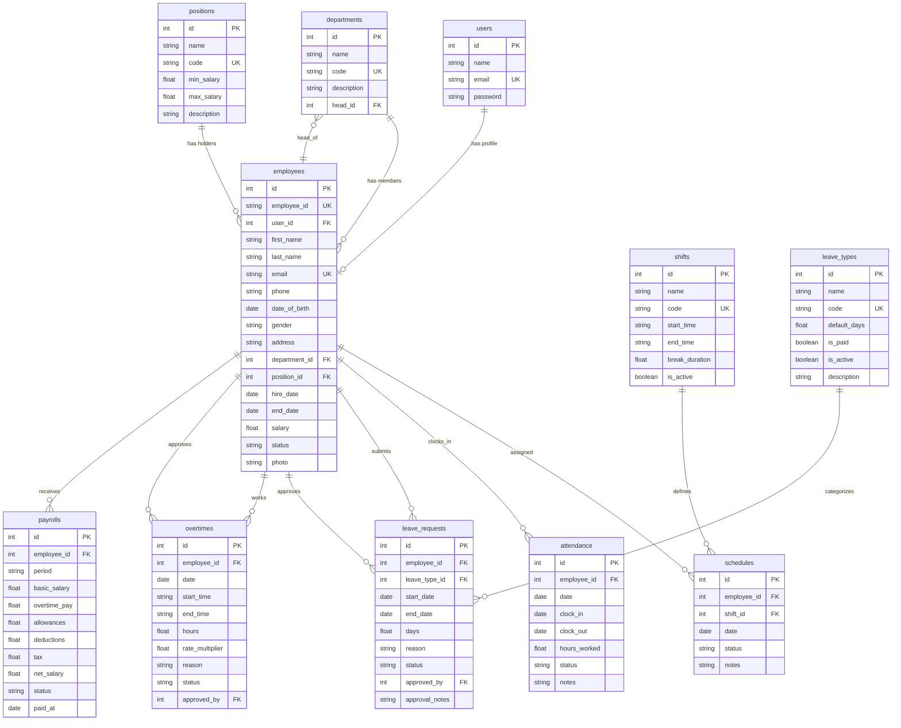

# ERD — Employee Management System

> Auto-generated from migrations & models. Terakhir diupdate: 2026-07-23

## Diagram Relasi (Mermaid)

## Ringkasan Relasi

| Dari | Ke | Tipe | Foreign Key | Keterangan |
|---|---|---|---|---|
| `users` | `employees` | 1 : 0..1 | `employees.user_id` | Satu user bisa punya profil employee |
| `departments` | `employees` | 1 : N | `employees.department_id` | Satu departemen punya banyak karyawan |
| `positions` | `employees` | 1 : N | `employees.position_id` | Satu jabatan diisi banyak karyawan |
| `departments` | `employees` | N : 1 | `departments.head_id` | Departemen punya satu kepala (self-ref) |
| `employees` | `schedules` | 1 : N | `schedules.employee_id` | Karyawan punya banyak jadwal |
| `shifts` | `schedules` | 1 : N | `schedules.shift_id` | Satu shift dipakai banyak jadwal |
| `employees` | `attendance` | 1 : N | `attendance.employee_id` | Karyawan punya banyak catatan absensi |
| `employees` | `leave_requests` | 1 : N | `leave_requests.employee_id` | Karyawan mengajukan banyak cuti |
| `leave_types` | `leave_requests` | 1 : N | `leave_requests.leave_type_id` | Satu jenis cuti dipakai banyak pengajuan |
| `employees` | `leave_requests` | 1 : N | `leave_requests.approved_by` | Karyawan menyetujui banyak pengajuan cuti |
| `employees` | `overtimes` | 1 : N | `overtimes.employee_id` | Karyawan punya banyak lembur |
| `employees` | `overtimes` | 1 : N | `overtimes.approved_by` | Karyawan menyetujui banyak lembur |
| `employees` | `payrolls` | 1 : N | `payrolls.employee_id` | Karyawan punya banyak slip gaji |

## Unique Constraints

| Tabel | Kolom | Keterangan |
|---|---|---|
| `schedules` | `(employee_id, date)` | Satu jadwal per karyawan per hari |
| `attendance` | `(employee_id, date)` | Satu absensi per karyawan per hari |
| `payrolls` | `(employee_id, period)` | Satu slip gaji per karyawan per periode |

## Cascade Rules

| Relasi | On Delete | Penjelasan |
|---|---|---|
| `employees.user_id` → `users` | `CASCADE` | Hapus user = hapus data employee |
| `employees.department_id` → `departments` | `SET NULL` | Hapus departemen = employee tanpa departemen |
| `employees.position_id` → `positions` | `SET NULL` | Hapus jabatan = employee tanpa jabatan |
| `schedules.employee_id` → `employees` | `CASCADE` | Hapus employee = hapus semua jadwal |
| `schedules.shift_id` → `shifts` | `CASCADE` | Hapus shift = hapus semua jadwal terkait |
| `attendance.employee_id` → `employees` | `CASCADE` | Hapus employee = hapus semua absensi |
| `leave_requests.*` → parent | `CASCADE` | Hapus employee/leave_type = hapus pengajuan |
| `leave_requests.approved_by` → `employees` | `SET NULL` | Hapus approver = approval kosong |
| `overtimes.*` → parent | `CASCADE` | Hapus employee = hapus semua lembur |
| `overtimes.approved_by` → `employees` | `SET NULL` | Hapus approver = approval kosong |
| `payrolls.employee_id` → `employees` | `CASCADE` | Hapus employee = hapus semua slip gaji |

## Database Tables

### Authentication & System (Laravel Default)

| Tabel | Fungsi |
|---|---|
| `users` | Akun login (name, email, password) |
| `password_reset_tokens` | Token reset password |
| `sessions` | Session storage (database driver) |
| `cache` / `cache_locks` | Cache storage |
| `jobs` / `job_batches` / `failed_jobs` | Queue system |
| `personal_access_tokens` | Sanctum API tokens |

### Business Domain

| Tabel | Fungsi |
|---|---|
| `employees` | Data lengkap karyawan (profile, kontak, kontrak) |
| `departments` | Unit organisasi (HRD, Engineering, dll) |
| `positions` | Jabatan dengan range gaji |
| `shifts` | Definisi jam kerja (pagi, siang, malam) |
| `schedules` | Penugasan shift ke karyawan per hari |
| `attendance` | Log absensi masuk/keluar |
| `leave_types` | Jenis cuti (tahunan, sakit, dll) |
| `leave_requests` | Pengajuan cuti dengan approval flow |
| `overtimes` | Pengajuan lembur dengan approval flow |
| `payrolls` | Slip gaji per periode |
